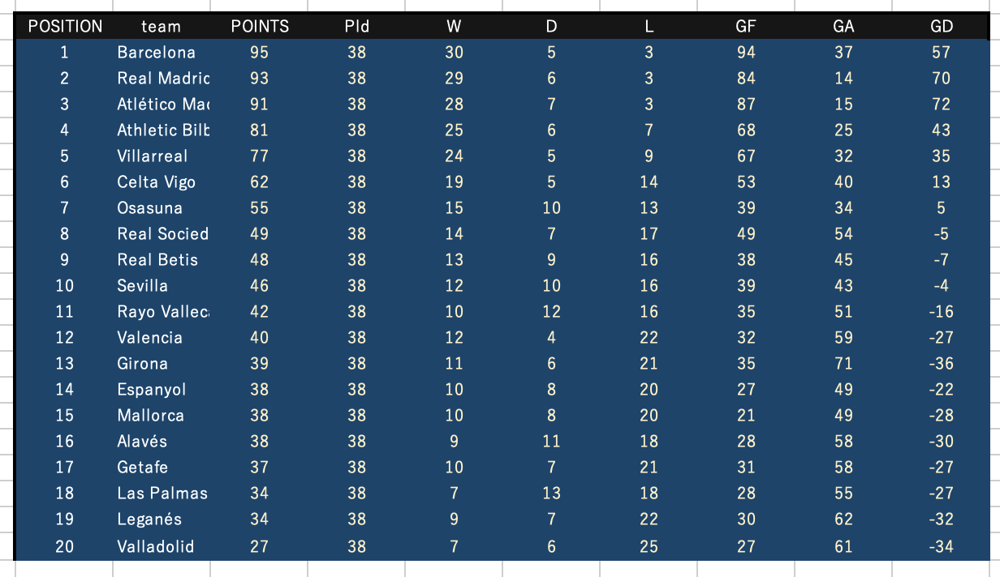

# Football League and Tournament Simulator
This is a Python-based football simulation system that supports league matches, player stats, and knockout tournaments (Champions League, Europa League, domestic cups, etc.).  
The simulation logic is based on team strength ("power") and randomized xG (expected goals) generation.


## Data Source

Team and player data are managed via the following Excel file:

[Team & Player Data Sheet (Excel)](https://docs.google.com/spreadsheets/d/1cUouy4gOSGkqZCv4oJla-PUMDvzGnjr3/edit?usp=sharing&ouid=110759171795341607233&rtpof=true&sd=true)

## Features

- Simulates full seasons for multiple leagues (Spain, England, Italy, Germany, France, etc.)
- Match outcomes generated based on team "power" and xG
- Player-level goal and assist statistics
- Standings tables and score rankings
- Champions League / Europa League / Copa del Rey knockout tournaments
- Exportable results (saved to Excel)

# Usage

1. Download the Excel file as `fb_real.xlsx`
2. Place it in the project root
3. Run:


```bash
python fbl.py
```

Results will be saved in the Excel file.


